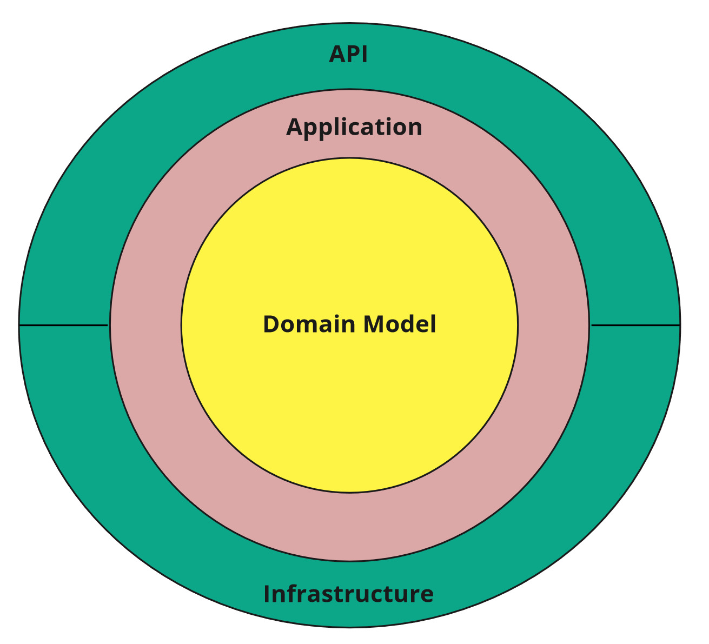
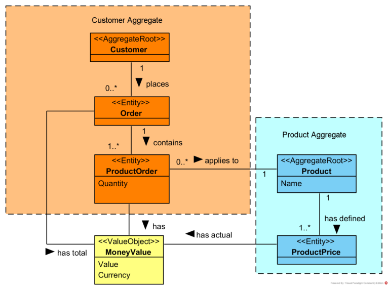

Sample .NET Core REST API CQRS implementation with raw SQL and DDD using Clean Architecture.
==============================================================

## CI

## Give a Star! :star:

If you like this project, learn something or you are using it in your applications, please give it a star. Thanks!

## Description
Sample .NET Core REST API application implemented with basic [CQRS](https://docs.microsoft.com/en-us/azure/architecture/guide/architecture-styles/cqrs) approach and Domain Driven Design.

## Architecture [Clean Architecture](http://blog.cleancoder.com/uncle-bob/2012/08/13/the-clean-architecture.html)

## CQRS

Read Model - executing raw SQL scripts on database views objects (using [Dapper](https://github.com/StackExchange/Dapper)).

Write Model - Domain Driven Design approach (using Entity Framework Core).

Commands/Queries/Domain Events handling using [MediatR](https://github.com/jbogard/MediatR) library.

## Domain

## Validation
Data validation using [FluentValidation](https://github.com/JeremySkinner/FluentValidation)

Problem Details for HTTP APIs standard implementation using [ProblemDetails](https://github.com/khellang/Middleware/tree/master/src/ProblemDetails)

## Caching
Using Cache-Aside pattern and in-memory cache.

## Integration
Outbox Pattern implementation using [Quartz.NET](https://github.com/quartznet/quartznet)

## Related blog articles

[Simple CQRS implementation with raw SQL and DDD](http://www.kamilgrzybek.com/design/simple-cqrs-implementation-with-raw-sql-and-ddd/)

[Domain Model Encapsulation and PI with Entity Framework 2.2](http://www.kamilgrzybek.com/design/domain-model-encapsulation-and-pi-with-entity-framework-2-2/)

[REST API Data Validation](http://www.kamilgrzybek.com/design/rest-api-data-validation/)

[Domain Model Validation](http://www.kamilgrzybek.com/design/domain-model-validation/)

[How to publish and handle Domain Events](http://www.kamilgrzybek.com/design/how-to-publish-and-handle-domain-events/)

[Handling Domain Events: Missing Part](http://www.kamilgrzybek.com/design/handling-domain-events-missing-part/)

[Cache-Aside Pattern in .NET Core](http://www.kamilgrzybek.com/design/cache-aside-pattern-in-net-core/)

[The Outbox Pattern](http://www.kamilgrzybek.com/design/the-outbox-pattern/)

## How to run application
1. Create empty database.
2. Execute InitializeDatabase.sql script.
2. Set connection string (in appsettings.json or by user secrets mechanism).
3. Run!

## How to run Integration Tests
1. Create empty database.
2. Execute InitializeDatabase.sql script.
3. Set connection string using environment variable named `ASPNETCORE_SampleProject_IntegrationTests_ConnectionString`
- Run tests from project [src/Tests/SampleProject.IntegrationTests](src/Tests/SampleProject.IntegrationTests)
